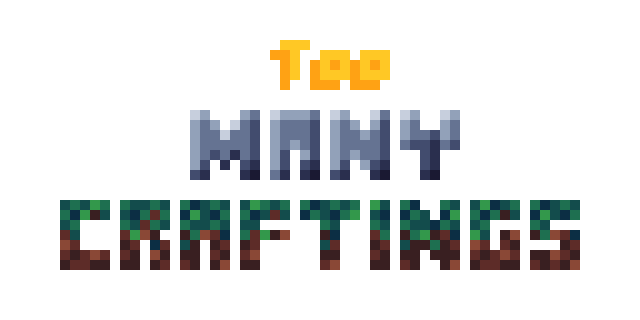

## Too Many Craftings [tmcraftings]
Copyright(C) 2020-2024 Mikaela M. D. Souza

Current version: 2.6

### 2.6 Update
\- Lot of tiny bugs 
\* Changed some textures (pistons and enchanted chest) 
\* Other minor code changes 

### 2.0 Update news

\+ Magic circuits system update 
\+ Gold and Cursed Ruby 
\- Furnaces progress bug 
\* Fixed obsidian mining level 
 
This is the official repository for the Too Many Craftings (tmcraftings) mod for the Minetest game.
Read `readme.txt` for more informations about the mod.

[[Mod Wiki](https://github.com/PixetBits/tmcraftings/blob/master/WIKI.pt.md)]

## License
Code: 
Copyright(c) 2020 PixetBits 
see `license.txt` for details. 

Media (textures): 
Copyright(C) 2020 PixetBits; 
Copyright(C) 2010-2018 Various Minetest developers and contributors*; CC-BY-SA 3.0 
see `license.txt` for details.
